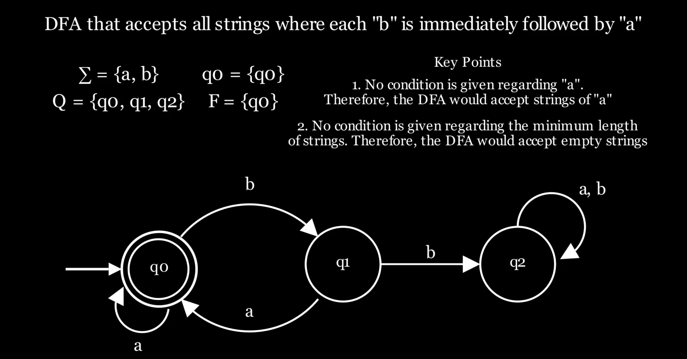
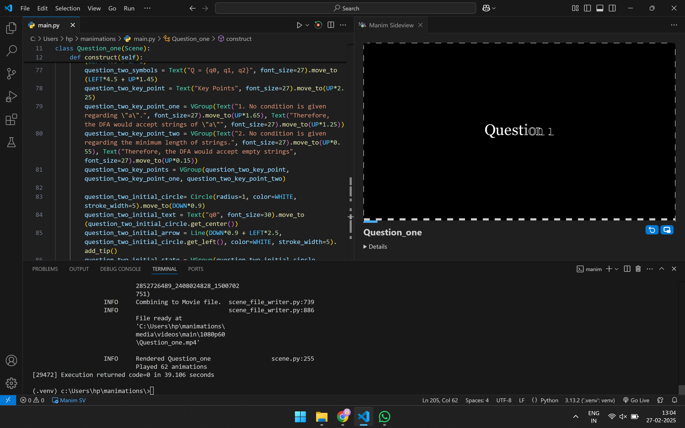
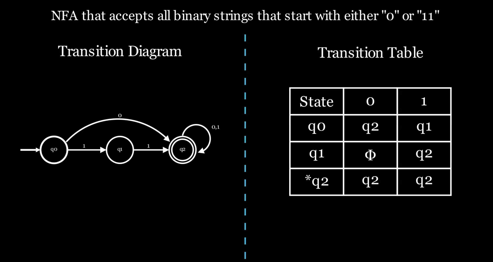
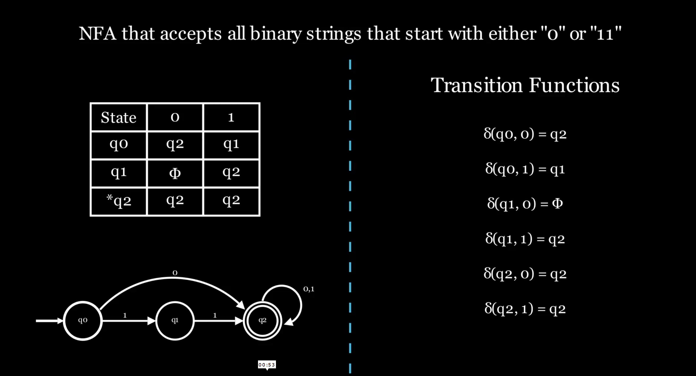

# Animating Finite Automatas using python

## A python script written using the manim library to animates an example of NFA and DFA problem

In this script, I have animated state diagrams, transition tables and transitions for two basic Theory of Computation Concepts

* NFA - language that either starts with "0" or "11"
* DFA - language  where "b" is immediately followed by "a"

In this script, I've made use of multiple built in objects provided by manim
* Circles
* Tables
* Arrows
* Arcs
* Arcs between points
* Text

Also used multiple animation properties
* FadeIn
* FadeOut
* animate
* Shift
* Scale
* Write
* Create

## Some screenshots from the animation

## Watch the Animation Video !!!
<a href="https://youtu.be/MWJLzZ-WxB8" target="_blank">
    link to the video
</a>

## installing python and manim for windows

open the windows powershell and perform the following steps

1. Install python management tool - `powershell -ExecutionPolicy ByPass -c "irm https://astral.sh/uv/install.ps1 | iex"`
2. Install python - `uv python install`
3. Create new directory for project - `uv init manimations`
4. Go into the directory - `cd manimations`
5. Add manim as dependency - `uv add manim`
6. Move to the manimations directory - `cd manimations`
6. Checking the manim installation - `uv run manim checkhealth`
